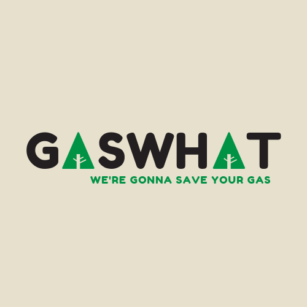

# GasWhat - DubHacks 2019 Project
### by Anwar Amminudin, Donghee Lee, and Jeremy Tandjung
## Inspiration
At first, we asked, "**what problem** can we help solve with this hackathon?", and we started to look to ourselves for everyday problems since we are college students :). One of our members mentioned something about the fluctuating gas prices and the increasing fossil fuel consumption. So we wanted to make an app that can help people save gas, and **GasWhat, we are going to save your Gas!**

## What it does
The app retrieves gas consumption data from the fueleconomy.gov API based on the car model, year, and make that the user inputs. Then, the app asks the user to give put in a destination. The app uses the user's GPS data to figure out the average gas price from close gas stations, using gasfeed API. Finally, the app gives routes (sometime, multiple routes) and an estimate of how much he or she is going to spend on gas depending on the route they choose.

## How we built it
We decided to make this app on android since the three of us have worked on an android app this past summer for a research project. We then had to list the things that we needed: _vehicle gas consumption rate, average gas price based on location, and possible routes._

We then needed to research the appropriate APIs to get those information. It was all of our first time using an API to build an android application, so we tried our best to learn and teach ourselves in this new topic. For this project, we ended up using Google Maps Directions API, the EPA vehicle API, and myGasApp's gas consumption API. For development we used Android Studio, Google Cloud, and Google Maps SDK for android.

## Challenges we ran into
XML parsing, permissions, json parsing in Java, Polyline listeners, and using APIs in android studio.

## Accomplishments that we're proud of
Surprisingly, the app is running and functional as we initially planned. We're also proud that we could combine all these APIs to solve a real-world problem. 

## What we learned
XML parsing, permissions, json parsing in Java, using APIs, Polyline listeners, android development, google Cloud.

## What's next for GasWhat
Add more features to the app (factors in traffic, polyline changes color when tapped)

## Note
Please insert your own google maps API key in naviApp/app/src/debug/res/values/google_maps_api.xml :)
